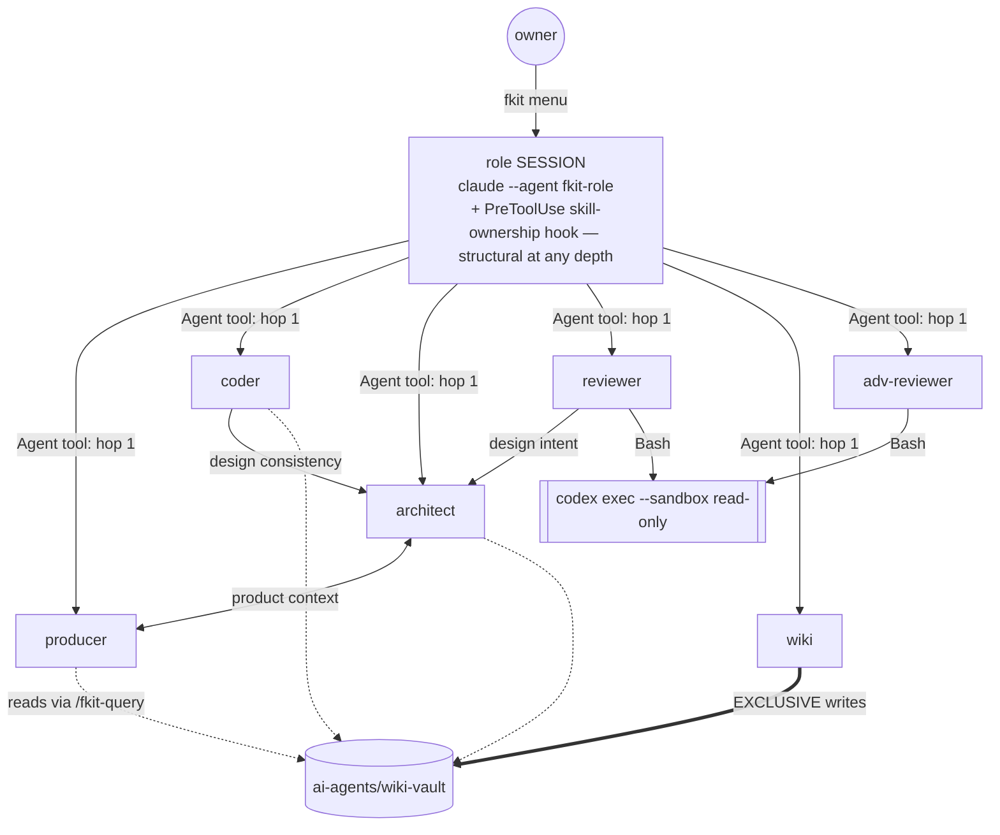

# fkit — Architecture

**The architecture of the system as it exists today** (last refreshed 2026-07-23; originally
2026-07-11, post-Omnigent-removal). One runtime, **seven built roles** (an eighth, a sandboxed e2e
tester, is authorized in [ADR-028](decisions/adr-028-fkit-gains-an-eighth-role-a-sandboxed-e2e-tester.md)
but **not yet built**), no orchestrator *daemon* (the `fkit-lead` conductor is an in-session driver, not runtime infrastructure — §5.1), everything coordinated through files in git.

Every claim carries a `path:line` reference. Anything the code could not answer is an open question
(§11), not a guess.

---

## 1. What fkit is

fkit is **not an application.** It is a **distributable team of role-scoped AI agents for software
development** — producer, coder, reviewer, adversarial reviewer, architect, wiki librarian, and a
"team room" lead — that a developer installs once and then runs inside *their own* project. That is
**seven roles as built**; an eighth, a sandboxed e2e tester, is a decision taken
([ADR-028](decisions/adr-028-fkit-gains-an-eighth-role-a-sandboxed-e2e-tester.md)) and **not yet
built** — described where the roles are (§4.1), not counted among them.

This repository **is the framework**. Its "source" is:

- **agent definitions** — markdown + YAML frontmatter (`claude/agents/fkit-*.md`, 7 files)
- **skill playbooks** — markdown procedures (`claude/skills/fkit-*/SKILL.md`, 25 dirs)
- **POSIX shell** — the installer, the launcher, the per-project setup
- **one small Node script** — `bin/release.mjs`, to cut a release
- **a scaffold** — `claude/scaffold/`, the `ai-agents/` tree a consuming project receives

There is no build step, no server, no database, and no runtime state outside files. There **is** a
zero-dependency test suite (`node --test` + a hand-rolled mutation gate) but **no CI to run it** — see
§9.1.

The product thesis (`ai-agents/knowledge-base/PROJECT.md:18-24`): AI coding assistants collapse
product decisions, implementation, and review into one undifferentiated chat loop with **no
separation of authority**. fkit's answer is a small **team** with distinct authority, coordinating
over **files in git** rather than shared runtime state.

**Stage:** prototype, dogfooded — this repo runs its own agents on its own `ai-agents/` tree
(`CLAUDE.md:16-24`).

---

## 2. System context and external dependencies

| Dependency | How it's used | Where |
|---|---|---|
| **Claude Code CLI (`claude`)** | **The runtime.** Every role session is `claude --agent fkit-<role> --settings <role>.json`. Hard requirement — the launcher exits **127** without it. | `claude/fkit-claude.sh:257-262,357` |
| **Codex CLI (`codex`)** | The adversarial second opinion, for genuine **model diversity**: `codex exec --sandbox read-only --cd "$PWD" -`. **Required, but warned — never walled** (owner ruling, Sprint 2 task 3): a Codex outage must not lock the owner out of their own team. | `claude/fkit-claude.sh:274-285`; `claude/skills/fkit-review/SKILL.md:57` |
| **git** | The substrate every agent reads. Agents are barred from committing/pushing unprompted — a **prompt rule, not a sandbox** (`CLAUDE.md:26-30`). | — |
| **GitHub, over the network** | (a) install: tarball from `codeload.github.com`; (b) self-update **check**: throttled `git ls-remote` or the commits API; (c) the version string: raw `VERSION`. All time-boxed to 5 s and silent on failure. | `install.sh:32,55-62`; `claude/fkit-claude.sh:64,74-93` |
| **Node (ESM)** | Only to cut a release (`npm run release`). **Zero npm dependencies.** | `package.json:3-9`, `bin/release.mjs` |

**fkit opens no ports, exposes no API, and stores no data outside the project's own files.**

The single-vendor coupling (Claude Code + Codex, no fallback runtime) is a **decision, taken
knowingly** — [ADR-009](decisions/adr-009-claude-code-native-is-the-only-runtime.md)
§Consequences. See §9.2.

---

## 3. Repository structure

```
fkit/
├── claude/                        THE RUNTIME
│   ├── agents/fkit-*.md             7 Claude Code subagent definitions (frontmatter + system prompt)
│   ├── skills/fkit-*/SKILL.md       25 /fkit-* skills — the role procedures
│   ├── scaffold/                    what a consuming project gets: ai-agents/, CLAUDE.md, AGENTS.md
│   ├── fkit-claude.sh               the `fkit` command: self-update, preflight, role menu, launch
│   ├── fkit-claude-init.sh          idempotent per-project setup (scaffold + .claude/ refresh + intake)
│   └── README.md                    the flavor write-up
├── install.sh                     curl|sh entry point — installs claude/ + the `fkit` launcher
├── bin/release.mjs                bump VERSION+package.json → commit → tag v<x.y.z> → push (ADR-011)
├── VERSION / package.json         version single source of truth + release scripts
├── ai-agents/                     fkit's OWN working structure (dogfooded — see §6)
└── README.md / CLAUDE.md / AGENTS.md
```

Local, gitignored, not part of the design surface: `.fkit/` (per-project generated state), the
fkit-managed `.claude/agents/fkit-*.md` + `.claude/skills/fkit-*/` copies, `.codex-tmp/`
(`.gitignore:1-20`).

---

## 4. Components

### 4.1 The seven roles

Each role is **one file**: `claude/agents/fkit-<role>.md` — YAML frontmatter (`name`, `description`,
`color`, `initialPrompt`, and — only for the adversarial reviewer — `tools`) plus a system prompt in
the body. There is no shared base class; each prompt restates its own boundaries.

Per [**ADR-022**](decisions/adr-022-tools-unrestricted-except-adversarial-reviewer.md) (2026-07-18),
**the six Claude-side roles carry no `tools:` line at all** — a subagent with no `tools:` field
inherits the full Claude Code tool set. Only the adversarial reviewer keeps an explicit allowlist.

| Agent | `tools` | Authority (prompt-enforced unless noted) |
|---|---|---|
| `fkit-producer` | *(none — inherits all)* | product & sprint planning, task briefs. **No source writes.** Owns the task-movers' namespace (any role may invoke them — ADR-025). |
| `fkit-coder` | *(none — inherits all)* | **Sole source-write authority.** Plan-gated. |
| `fkit-architect` | *(none — inherits all)* | design specs, ADRs, surveys. **Never implements; never writes the wiki.** |
| `fkit-reviewer` | *(none — inherits all)* | review-only; writes **only** under `ai-agents/reviews/`. |
| `fkit-wiki` | *(none — inherits all)* | **exclusive write gateway** for `ai-agents/wiki-vault/` (ADR-005). |
| `fkit-lead` | *(none — inherits all)* | the **team room + orchestrating conductor** (menu 7; ADR-031). **Routes** ("who do I need?") **and drives**: spawns/sequences peers, holds the owner channel, relays owner decisions live. Owns `sprint-ship-loop` (ADR-032). **Writes no source, never reviews** — each role's work runs in its own fresh spawned context, so separation-of-authority holds. |
| `fkit-adversarial-reviewer` | `Read, Grep, Glob, Bash, Skill` | findings only. **Structurally write-free — a leaf, and the one deliberate tool wall.** |

Evidence: `claude/agents/fkit-adversarial-reviewer.md:9` (the sole surviving `tools:` line); the other
six files carry no `tools:` frontmatter.

**The one remaining structural tool wall is the adversarial reviewer's** (ADR-022 Decision 2–3). It
holds no Write/Edit/Agent, so *"the independent, model-diverse second opinion never touched the code it
is judging"* is a **structural fact, not a promise** — the invariant closest to fkit's separation-of-
authority thesis, deliberately kept when every other wall was relaxed. For the six unrestricted roles,
role separation now rests on **prompts + the skill-ownership hook (ADR-018)**, not on tools — a knowing
tradeoff (ADR-022 Consequences): the tool wall was never a real sandbox anyway (any agent with `Bash`
can write via the shell — ADR-008:85), while the **skill lockdown is untouched** (§4.2, ADR-018) so a
role still cannot run another role's *procedure*.

> **There is no `skills:` frontmatter.** It was dropped from all 7 agents per
> [**ADR-012**](decisions/adr-012-skill-lockdown-is-session-scoped-frontmatter-dropped.md) §1: Claude
> Code treats it as a *preload hint*, not an allowlist, so it enforced nothing. Keeping it — even
> generated — would have preserved a field that *looks* like the invariant and isn't. **Do not
> re-add it.**

> **An eighth role is decided but not built.**
> [**ADR-028**](decisions/adr-028-fkit-gains-an-eighth-role-a-sandboxed-e2e-tester.md) (2026-07-19)
> authorizes a **sandboxed e2e tester** — the first role whose distinguishing authority is a
> *permission envelope* (a sandbox) rather than a skill, and the decision on which the owner
> **knowingly reversed** the "seven roles, not breadth" constraint. **It does not exist yet:**
> `claude/agents/` holds **seven** `fkit-*.md` files, no tester among them. The row above is therefore
> the whole built team; this note is the plan. When the tester ships, it becomes an eighth table row —
> until then, "seven roles" is the fact and "eight" would be a claim about code that is not there.

### 4.2 The 25 skills — where the procedures live

Skills (`claude/skills/fkit-*/SKILL.md`) are the durable, role-owned **procedures**; the agent
prompts are the role's *character*. Every role-specific skill opens with a `⛔ Owner:` banner naming
the one role allowed to execute it (e.g. `claude/skills/fkit-review/SKILL.md:8`). Only `fkit-query`
carries no banner — it is universal by design.

| Owner | Skills |
|---|---|
| lead | `sprint-ship-loop` (the conductor loop — ADR-031/032) |
| producer | `initiate-project`, `task-brief`, `task-done`, `task-cancelled`, `status` |
| coder | `plan-task`, `process-review`, `process-stateful-review`, `task-ship-loop` |
| architect | `survey-project`, `inspect`, `design-spec`, `evaluate-approach`, `record-decision` |
| reviewer | `review`, `stateful-review` |
| adversarial reviewer | `adversarial-review` |
| wiki | `wiki-ingest`, `wiki-lint`, `wiki-sync` |
| everyone | `team` (the roster/signpost), `query` (read-only wiki reads — ADR-005) |
| the six Claude-side roles *(all but `adversarial-reviewer`)* | `open-questions-interview` (ask the owner what this session left unanswered), `dumb-down` (re-explain the last answer simply). Excluded from the adversarial reviewer: it reviews on Codex under a restricted allowlist (ADR-022) and has no owner channel. |

**Ownership is declared in exactly one place: `skills_for_role()` at
`claude/skills-for-role.sh:35`.** That shell function is the **single source of truth** (ADR-012
§1) and the only place role→skill ownership is expressed anywhere in the codebase.

---

## 5. Runtime topology

### 5.1 One process. One role. No orchestrator *daemon*.

There is no fkit daemon, no root agent, no session broker, no message bus. **Claude Code owns the
session lifecycle**; fkit is a launcher and a set of prompts. *(The `fkit-lead` **conductor** (ADR-031,
§4.1) is not a counter-example: it is an ordinary in-session agent that drives peers via the Agent
tool — a role that orchestrates, introducing no daemon, broker, or bus.)*

```
install.sh   (curl | sh — once)
   └─► ~/.local/share/fkit/{claude/, .version}   +   ~/.local/bin/fkit  (thin launcher)

fkit                                    (run in any project directory)
   ├─ self-host re-exec into ./claude/fkit-claude.sh if this IS an fkit checkout   :36-43
   ├─ `fkit update` → re-run install.sh                                            :104-118
   ├─ else: throttled update CHECK → prints "run fkit update" (never auto-execs)   :121-141
   ├─ fkit-claude-init.sh <proj>  (idempotent: scaffold, .claude/ refresh, intake) :249-253
   ├─ preflight:  claude REQUIRED (exit 127)  ·  codex required-but-WARNED         :257-285
   ├─ fresh project? → skip the menu, seed the PRODUCER into /fkit-initiate-project:288-307
   ├─ deterministic role MENU (1-7 — an if/else; no LLM anywhere in the routing)   :311-345
   └─ exec claude --agent fkit-<role> --settings .fkit/settings/<role>.json        :357
```

Two roles at once = **two terminal tabs**. Deliberately not automated
(`claude/fkit-claude.sh:19-21`).

### 5.2 The role lock — and precisely what it does and does not enforce

A session is locked **two ways**:

1. **`--agent fkit-<role>`** — the role's system prompt (and, for the adversarial reviewer only, its
   `tools:` allowlist). Harness-enforced. Since ADR-022 the six other roles carry no `tools:` line, so
   for them this half of the lock is the system prompt alone; the adversarial reviewer's tool wall
   still binds at any spawn depth.
2. **`--settings` wiring a `PreToolUse` skill-ownership hook** — `build_settings()`
   (`claude/fkit-claude.sh:257-265`) writes `{"hooks":{"PreToolUse":[{"matcher":"Skill",…}]}}` pointing
   at `claude/skill-ownership-hook.sh`. The hook **denies** a `Skill` call whenever the **real invoking
   agent's role** — read from the payload's `agent_type` and stripped to a role — does not own the skill
   per `skills_for_role()` (`claude/skill-ownership-hook.sh:110-136`). Non-fkit skills are never touched.
   This **replaced** the old `skillOverrides` "off" list
   ([**ADR-018**](decisions/adr-018-pretooluse-skill-ownership-hook-replaces-consult-skills-exception-list.md),
   which retired both it and the `CONSULT_SKILLS` exception).

**The scope of that lock is the load-bearing detail — and ADR-018 changed it.** Enforcement follows the
**real caller's identity at any spawn depth**, not the launching session's settings (superseding
ADR-012 §2's session-scoped model):

```
a Skill call in ANY context (session OR spawned consult, any depth) is
  ALLOWED  ⇔  skills_for_role(agent_type of the REAL invoking agent) owns it
```

- **In a role SESSION the lock is structural.** `fkit coder` genuinely cannot run `/fkit-review` — the
  hook denies it. **This is the property reviewer independence rests on, and it holds.**
- **In a spawned CONSULT it is now *also* structural** (ADR-018, superseding ADR-012 §2's "advisory in
  a consult"). The hook reads the *spawned subagent's own* `agent_type` — confirmed empirically at
  0/1/2 hops — so a consult reaches exactly its own role's skills, never the launcher's. The skill's
  `⛔ Owner:` banner is now the **human-readable** owner, no longer the enforcement.
- **Two accepted costs** (ADR-018 §Consequences): a non-owned skill stays **visible** in the `/` menu
  (denied only on invocation, not hidden); and a **non-fkit** subagent (`general-purpose`, `Explore`)
  carries no fkit `agent_type`, so it is denied **every** `fkit-*` skill — `fkit-query` included —
  fail-closed by design. Hook internal errors also fail **closed** (deny), never open.

> **A second hook is decided but not built.** A `Stop` hook enforcing the **turn-completion contract**
> — interactive questions actually asked, a "What's next?" close — is authorized in
> [**ADR-030**](decisions/adr-030-stop-hook-enforces-turn-completion-contract.md) (2026-07-19) because
> the prose rule for it *demonstrably did not fire*. It would make turn-completion structural the way
> ADR-018's `PreToolUse` gate made skill ownership structural. **It does not exist yet** —
> `claude/` ships no such hook script; today the contract is prompt-only. Larger blast radius than
> ADR-018's, since a `Stop` hook can block a turn from completing — which is why it is decided but held.

**`CONSULT_SKILLS` and the `skillOverrides` off-list are gone — both retired by ADR-018.** They were a
*session-scoped* mechanism: they governed what the launching process could see, so a consult inherited
the *launcher's* list, never its own — the bug class ADR-018 fixes. With enforcement keyed on the real
caller's `agent_type`, no always-on exception list is needed. `/fkit-initiate-project` still has the
**producer** spawn the architect to run `fkit-survey-project`; the architect's own identity now lets the
hook allow it, with no carve-out — and the old leak (`fkit-survey-project` reachable from every session
by name) closed as a side effect. **Do not re-add either mechanism** (ADR-018 §Options).

### 5.3 Consultation — the Agent tool, two hops, no cycles

Cross-role work is a **consult**, never a role switch (ADR-010 §4). `@fkit-<role> <question>` spawns
a fresh context that answers and returns; the asker keeps the decision that is theirs.

The rules are carried in every agent prompt ("Consult rules — hard"):

- an invocation from the owner's session is **hop 0**; every consult message must state *"you are
  being consulted at hop N of 2"*;
- **at hop 2 you may not consult anyone** — answer from the code, or return an open question;
- **never consult your invoker**, or anyone already named in the chain (the chain is passed along);
- **genuinely new architecture decisions escalate to the owner** — never settled implicitly between
  agents.

**This topology is prompt-enforced, and knowingly so**: Claude Code ignores `Agent(type)` allowlists
inside *subagent* definitions, so the hop budget cannot be made structural (ADR-010 §Consequences).
It *was* structural in one place — `fkit-lead`'s own scoped `Agent(...)` list — but that line was
dropped when the lead's `tools:` frontmatter was removed
([**ADR-022**](decisions/adr-022-tools-unrestricted-except-adversarial-reviewer.md) Decision 1). The
consult topology is now **prompt-enforced everywhere, with no structural exception** — a small,
knowingly-taken loss (ADR-022 Consequences).



---

## 6. Data model — everything is a file in git

There is no database. The **`ai-agents/` tree is the entire coordination state**, and the file
contract every role shares (`ai-agents/README.md`).

| Path | Written by | Contents |
|---|---|---|
| `knowledge-base/PROJECT.md` | producer (`initiate-project`) | the prose product brief. **One of the only two documents allowed at the knowledge-base root** (ADR-013). |
| `knowledge-base/architecture.md` | **architect** (`survey-project` / `inspect`) | this file — the other root document. Nothing else lives at the root. |
| `knowledge-base/conventions/*.md` | whoever owns the convention; **new ones need the owner** | **standing rules the project reads on a normal run and obeys** — `task-status-vocabulary.md`, `status-report-format.md`. Prescriptive, maintained in place, **never dated**. [`conventions/README.md`](conventions/README.md) |
| `knowledge-base/decisions/adr-NNN-*.md` | **architect** (`record-decision`) | ADRs — settled decisions: *why* the rule is what it is. The **"Re-raise only if"** field is what stops future reviews re-litigating a settled decision. No README: the `adr-NNN-<slug>` sequence *is* the convention. |
| `knowledge-base/incidents/YYYY-MM-DD-*.md` | any session | postmortems of **fkit's own runtime/tooling** — not product bugs (those are task briefs). [`incidents/README.md`](incidents/README.md) |
| `knowledge-base/reports/YYYY-MM-DD-*.md` | any session; evaluations from the **architect** | dated artifacts of work performed — audits, verifications, evaluations, executed plans. [`reports/README.md`](reports/README.md) |
| `knowledge-base/history/` | architect | superseded **design docs** — docs that no longer describe reality. **Archive, don't delete** (ADR-002). Narrow, *not* the general archive. [`history/README.md`](history/README.md) |
| `sprints/sprint-N.md` | producer | sprint plan + status table; completed sprints move to `sprints/done/` |
| `tasks/{backlog,done,cancelled}/<NNNN>-<slug>/` | producer **writes** the brief; **any role but `adversarial-reviewer` moves the folder**, via `/fkit-task-done` and `/fkit-task-cancelled` (ADR-025; an agent-performed close is marked `(agent-closed — not owner-verified)`) | **A task is a folder, not a file** ([ADR-029](decisions/adr-029-a-task-is-a-folder-keyed-by-a-permanent-global-id.md), migrated 2026-07-22). The folder is keyed by a **permanent four-digit global ID** (`0001`…, never reused, never renumbered) and holds `brief.md` plus, when they exist, `plan.md`, `worklog.md`, `review.md`, and an `assets/` dir. The board (`backlog`/`done`/`cancelled`) is the folder's **parent**. |
| *(within each task folder)* `review.md` | reviewer **and** coder — a two-party ledger | findings + dispositions + **accepted residuals**. The loop-prevention memory: it carries decision state across review rounds so settled tradeoffs are not re-litigated. **Absorbed into the task folder by ADR-029** — the former top-level `reviews/<task-id>.md`, along with `plans/` and `worklogs/` (ADR-020), no longer exist; a task's artifacts now live with its brief. |
| `wiki-vault/` | **`fkit-wiki` only** | Karpathy LLM-wiki: `schema.md` (conventions), `index.md` (catalog), `log.md` (activity), `wiki/{features,systems,decisions,tasks}/` |

**Three invariants govern this tree:**

1. **Wiki reads are decentralized; wiki writes are exclusive to `fkit-wiki`** (ADR-005). Any context
   may follow the read-only `/fkit-query` procedure. **No other agent or session ever writes under
   `ai-agents/wiki-vault/`.** No exceptions.
2. **The task status vocabulary is closed**
   (`ai-agents/knowledge-base/conventions/task-status-vocabulary.md:11-21`): Backlog · In progress ·
   Blocked · Done · Cancelled · Moved, plus the `(agent-closed — not owner-verified)` variants of the
   last two. Nothing else is valid. `Done` and `Cancelled` are **skill-gated, not owner-gated**
   (ADR-025): any role but `adversarial-reviewer` may invoke the movers, and the agent-closed marker —
   **prose, unenforced** — is all that replaced the old owner-only gate.
3. **The knowledge-base root holds exactly two documents — `PROJECT.md` and `architecture.md`**
   ([ADR-013](decisions/adr-013-knowledge-base-root-holds-the-living-canon.md)). They are the
   project-defining pair: *what we are building* and *how it is built*. **Everything else is filed by
   kind** — `conventions/` (standing rules: *how we do it*), `decisions/` (ADRs: *why*), `incidents/`
   (what happened to our runtime), `reports/` (work performed at a point in time), `history/`
   (superseded designs). The checkable forms: **`ls knowledge-base/*.md` returns exactly those two
   names**, and **a dated filename never lives at the root or in `conventions/`** — a dated name means
   "a record of a moment". Records are never *superseded*, so they are never relocated once filed —
   only designs go stale.

**Generated, gitignored, per project:** `.fkit/settings/<role>.json` (the skill lockdown),
`.fkit/interview` + `.fkit/intake.md` (terminal intake), `.fkit/tmp/adversarial-prompt.md` (the
Codex prompt), and the fkit-managed `.claude/agents/fkit-*.md` + `.claude/skills/fkit-*/` copies —
**edit `claude/`, never these** (`claude/fkit-claude-init.sh:49-60`).

**Global, per install:** `~/.local/share/fkit/.version` (`version`/`sha`/`repo`/`ref`),
`.update-check` (throttle stamp), `.latest` (`install.sh:55-72`, `claude/fkit-claude.sh:66-72`).

---

## 7. Key flows

**1 — Install.** `curl … install.sh | sh` → fetch the tarball → **sanity-gate the fetch** on
`claude/fkit-claude.sh`, the one file the installer cannot work without (`install.sh:34-37`) → copy
**only `claude/`** into `~/.local/share/fkit/` (`:42-43`) → `rm -rf "$SHARE/omnigent"`, which is what
makes an upgrade from an older fkit clean rather than leaving a dead runtime on disk (`:49`) → write
`.version` (`:55-72`) → generate `~/.local/bin/fkit`.

That generated launcher is a **direct `exec`** of `$SHARE/claude/fkit-claude.sh` (`install.sh:101`) —
there is no flavor dispatch and `update` is **not** intercepted; it falls through to the launcher,
which owns self-update. Four subcommands are **retired and fail loudly** rather than being passed
through to `claude` as a stray argument: `omnigent`, `claude`, `reconnect`, `restart-team`
(`install.sh:86-95`).

**2 — Fresh-project onboarding.** `fkit` → init scaffolds `ai-agents/` + `CLAUDE.md` + `AGENTS.md`,
**never clobbering** an existing one (`claude/fkit-claude-init.sh:26-47`) → `.fkit/interview` asks 6
questions **on the terminal, before any LLM starts**, writing `.fkit/intake.md`; it is tty-safe and
skips cleanly when headless (`:62-123`) → the launcher detects the uninitialized `PROJECT.md`
(`claude/fkit-claude.sh:288-294`), **skips the menu**, and seeds the producer straight into
`/fkit-initiate-project` (`:295-307`) → the producer interviews the owner, **spawns the architect to
run `fkit-survey-project`**, and writes `PROJECT.md`.

**3 — Task flow.** producer `/fkit-task-brief` (decompose to the **smallest independently shippable**
units, with dependencies recorded) → coder `/fkit-plan-task` (**Claude Code plan mode** — an owner
approval gate) → implement → reviewer `/fkit-review` or `/fkit-stateful-review` → coder
`/fkit-process-stateful-review` (verify each finding; **defect vs frontier-move**; fixes gated on
the owner) → `/fkit-task-done` — run by the owner, or by an agent writing the agent-closed marker
(ADR-025). The coder can also run this brief-to-done sequence as **one autonomous loop**,
`/fkit-task-ship-loop` ([ADR-019](decisions/adr-019-autonomous-coder-ship-loop-default-autonomy-owner-gates.md)):
after a single up-front plan approval it runs autonomously, stopping only for the owner's important
questions, and persists a per-task `plan.md` + `worklog.md` (ADR-020) as its durable memory. A
**timeout that would auto-proceed past those owner questions was designed and declined** on cost —
[ADR-024](decisions/adr-024-ship-loop-owner-question-timeout-is-not-built.md), a tombstone: the loop
waits for a real answer rather than guessing one.

**4 — Review + the adversarial pass.** The reviewer runs its own pass, then assembles a
findings-only prompt plus an inline diff into `.fkit/tmp/adversarial-prompt.md` and pipes it to
`codex exec --sandbox read-only --cd "$PWD" -` (`claude/skills/fkit-review/SKILL.md:38,57`).
**Degradation is loud and mandatory:** no Codex → the review **leads with**
`⚠️ [NOT model-diverse — INCOMPLETE]` as the first thing a reader sees, not a footnote
(`:128-135`; `claude/skills/fkit-adversarial-review/SKILL.md:57,111`). The failure this guards
against is a same-model "second opinion" — the model that wrote the code reviewing its own work, and
the *unearned confidence* that produces.

**5 — Self-update** ([ADR-009](decisions/adr-009-claude-code-native-is-the-only-runtime.md) §3).
Two paths, and the split is the design:

- **`fkit update`** — an **explicit verb**. Re-runs the canonical `install.sh` for `$repo@$ref`
  (`claude/fkit-claude.sh:104-118`). Refuses to run in a source checkout ("update it with `git
  pull`").
- **the automatic check** — throttled (60 min default), **time-boxed to 5 s**, silent when current
  and silent when offline, and it **only ever prints**:
  `↑ fkit vX → vY is available. Run: fkit update` (`:121-141`).

**It never auto-updates and never re-execs itself** — deliberately unlike the Omnigent launcher it
replaces, which had no timeout and no `GIT_TERMINAL_PROMPT` guard (a credential-prompting repo would
hang the launcher indefinitely). Source checkouts are excluded entirely
(`_fkit_is_source_checkout`, `:72`), keyed only on markers `install.sh` never copies (`.git`, the
repo-root `package.json`).

**6 — Release** ([ADR-011](decisions/adr-011-package-json-stays-with-scripts-npm-under-scoped-name.md)).
`npm run release` → `bin/release.mjs`: bump `VERSION` + `package.json` (patch by default), `git add
-A`, commit, push, annotated tag `v<version>`, push the tag. **No npm-registry publish**
(`bin/release.mjs:66`). **Version bumping is load-bearing** — self-update compares the installed sha
against the remote head and reports the version from `VERSION`.

---

## 8. History — fkit formerly ran on Omnigent

fkit originally shipped as [Omnigent](https://omnigent.ai) agent bundles under `omnigent/`.
[ADR-008](decisions/adr-008-claude-code-native-port-alongside-omnigent.md) added the Claude Code
native port **alongside** it (dual-runtime, hand-mirrored);
[**ADR-009**](decisions/adr-009-claude-code-native-is-the-only-runtime.md) superseded that and made
Claude Code native + Codex the **only** runtime. **`omnigent/` was deleted in Sprint 2** — 0 tracked
files remain (`git ls-files omnigent`), and `install.sh:49` actively cleans it out of pre-existing
installs.

This is recorded because it explains things that would otherwise look arbitrary:

- **Why the retired verbs fail loudly** (`install.sh:86-95`) instead of being silently dropped —
  `fkit omnigent`, `fkit claude`, `fkit reconnect`, `fkit restart-team` were all real commands.
  `reconnect` / `restart-team` existed *only* to paper over Omnigent orchestration failures.
- **Why self-update notifies rather than auto-updates** — a direct reaction to the Omnigent
  launcher's behavior (ADR-009 §3).
- **Why ADR-008 is kept and not deleted** — it is the record of *why fkit left Omnigent*.

**ADR-005's *rule* survives the removal and is in force** — reads decentralized, writes exclusive to
`fkit-wiki`. Only its Omnigent *mechanism* (per-bundle vendored skill copies) is gone. ADRs 003, 004,
006, and 007 describe Omnigent-only mechanics and are due to be marked superseded now that the code
is actually removed (ADR-009 §Related; tracked by
`ai-agents/tasks/backlog/knowledge-base-hygiene-post-omnigent.md`) — they are still marked
`accepted` today. See §9.5.

---

## 9. Risks and technical debt — the live ones

### 9.1 A test suite exists, but nothing runs it automatically — no CI

**There is a test suite; there is no CI.** [ADR-014](decisions/adr-014-how-fkit-tests-itself.md)
established how fkit tests itself, and `test/` now holds a real one: **eight `node --test` contract
suites** (`launcher-contract`, `converge-contract`, `dashboard-contract`, `skill-ownership-hook`,
`orphan-cleanup`, `rules-block-budget`, `adr-number-uniqueness`, `task-id-uniqueness`) plus
**`prove-red.sh`, a hand-rolled mutation gate** that proves each suite actually fails against a
deliberately-broken copy. The mutation gate is **hand-rolled by decision, not by omission** — 
[ADR-026](decisions/adr-026-no-mutation-testing-library-prove-red-stays-hand-rolled.md) weighed a
mutation-testing library and declined it; do not read `prove-red.sh` as a stopgap awaiting one. **Zero
npm dependencies**, run via `npm test` (`node --test test/*.test.js && bash test/prove-red.sh`).

**What the suite does not cover, and what that leaves at risk:**

- **No CI.** `.github/workflows/` does not exist, so the suite runs **only when someone remembers to
  run it** ([ADR-003](decisions/adr-003-ci-runs-validate-bundles.md)'s CI never landed; the
  `omnigent/validate-bundles.sh` it mandated died with the Omnigent removal). Green on a laptop is not
  green in the pipeline, because there is no pipeline.
- **`install.sh`** — the `curl | sh` entry point — has **no automated coverage**. A bad landing breaks
  installation *including the self-update path that would ship the fix*; it cannot be verified by
  reading a diff, and must be installed from a ref into a clean `$HOME`.
- **`claude/fkit-claude.sh`** is covered by `launcher-contract.test.js` (and its mutations proven by
  `prove-red.sh`), but that harness exercises the launcher's contract, not a real self-update over the
  network or a real menu on a tty — those edges stay manual.

**The residual risk shifted rather than closed:** the highest-blast-radius file (`install.sh`) is
still unverified, and the suite that covers the rest is not wired to run on its own. A `shellcheck`
pass, a smoke install into a temp `$HOME`, and a `.github/workflows/` that runs `npm test` would close
most of what remains, cheaply.

### 9.2 Single-vendor concentration — accepted, not a defect

fkit runs on Claude Code + Codex with **no fallback runtime**. If Claude Code makes a breaking
change, fkit has no second leg to stand on. **ADR-009 §Consequences takes this knowingly**, and it is
the main thing the decision buys its simplicity with. **A finding of the form "fkit only runs on one
vendor's CLI" is this decision, not a bug.**

### 9.3 The consult-path skill boundary is structural — closed by ADR-018

**Formerly a live risk; now closed, and recorded here so it is not re-raised.** ADR-012 §2 had this
boundary as *advisory*, and ADR-012 §4 flagged the deciding open question — *does the `PreToolUse`
payload expose the calling subagent's identity?* **Both are resolved:** the payload **does** expose the
real caller's `agent_type` at any spawn depth (verified 0/1/2 hops), and the skill-ownership hook was
built on it (ADR-018; §5.2; the `skill-ownership-hook` contract suite, §9.1). Per-role skill ownership
is now structural in a session **and** in a consult. The residual that remains is not this boundary but
the **`disableAllHooks` single-key kill switch** (ADR-018 §Consequences): the lockdown being entirely
hook-based, one operator-controlled settings key disables the whole gate — an operator-scoped risk, not
a third-party hole, accepted and recorded there.

### 9.4 The `.claude/` copies are gitignored and destroyed on every launch

`claude/fkit-claude-init.sh:51-60` does an `rm -f` + `cp` of `fkit-*` agents and skills on every
single launch. **An edit made in `.claude/` instead of `claude/` is silently destroyed** — no
warning, no diff. (The self-hosting re-exec at `claude/fkit-claude.sh:36-43` exists precisely because
the *installed* snapshot would otherwise overwrite the checkout's own working tree with an older
copy of itself.) The rule is unconditional: **edit `claude/`, never `.claude/`.**

### 9.5 Residual drift

- **`claude/fkit-claude-init.sh:144` prints "Six roles"** and omits `lead`, immediately after copying
  **7** agent files (`:53-54`, `n_agents`). The count is a literal, not derived.
- **`claude/fkit-claude-init.sh:17`** still advertises `fkit claude` in its usage comment — a verb
  that now **hard-fails** (`install.sh:87-90`).
- **ADRs 003, 004, 006, 007 are still marked `accepted`** though the code they describe is deleted
  (§8). ADR-009 said to mark them superseded *when the code is actually removed* — that condition is
  now met.

**Drift between the two homes is now governed.** fkit-authored files that live in **both** the
dogfooded `ai-agents/` tree and `claude/scaffold/` (what a consuming project receives) used to drift
silently. [ADR-027](decisions/adr-027-dual-home-parity-is-a-dev-time-convention-plus-test.md) makes
it a **dev-time convention plus a mechanical test** (`test/` parity check, §9.1): a dual-homed file is
edited in both trees in the same change, with an explicit exception list for the deliberately-divergent
placeholders (`PROJECT.md`, the wiki vault's own project data). Prevention is the convention; detection
is the test.

---

## 10. Cross-cutting concerns

- **Secrets.** No credential is read, written, or stored by any part of fkit. No agent may put a
  secret in any artifact. `GIT_TERMINAL_PROMPT=0` on the update check
  (`claude/fkit-claude.sh:76`) exists so a credential-prompting remote can never hang the launcher.
- **Network.** Every network call is optional, time-boxed to 5 s, and silent on failure. Offline
  `fkit` must cost nothing and print nothing (`claude/fkit-claude.sh:56-58,64`).
- **Idempotence.** Both the installer and the per-project init are safe to re-run; init never
  clobbers an existing `ai-agents/`, `CLAUDE.md`, or `AGENTS.md`.
- **Determinism where it matters.** Role routing is an `if/else` (`claude/fkit-claude.sh:311-345`).
  **No LLM sits in the path that decides which role you get.**
- **Git authority.** No agent commits or pushes unprompted. This is a prompt rule in every agent
  definition — not a sandbox — and it is the one place fkit's boundaries depend entirely on
  instruction-following. A **dedicated git agent** (with a commit/push consent model) was designed and
  **declined** — [ADR-023](decisions/adr-023-fkit-git-agent-is-not-built.md) (a tombstone: the "never
  commit unprompted" hard rule stands, and no eighth-role count ripple follows from it). The rule is
  the design, not a stopgap for a missing agent.

---

## 11. Open questions

1. **~~Does the `PreToolUse` hook payload expose the calling subagent's identity?~~ — RESOLVED (ADR-018).**
   It does, at any spawn depth; the skill-ownership hook is built on it and the consult-path boundary is
   now structural (§5.2, §9.3). Kept as a closed pointer so the once-open question is not re-opened.
2. **Is the test suite going to CI?** (§9.1.) The suite now exists (ADR-014; contract tests +
   `prove-red.sh` mutation gate, ADR-026) — the open part is that **nothing runs it automatically**.
   ADR-003's CI died with its subject and never landed. Is a `.github/workflows/` that runs `npm test`
   (plus `shellcheck` + a smoke install for `install.sh`) in scope, or is run-it-yourself the accepted
   posture for a prototype? An owner call, not an architect's.
