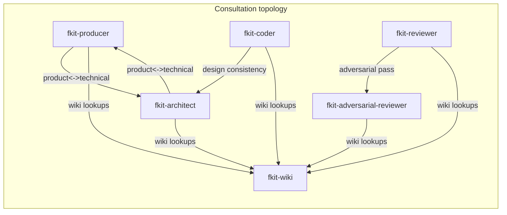

# fkit — Architecture

> **Initiation survey.** This is a first-pass, evidence-first pass written by the fkit-architect
> during project initiation (non-interactive — see `survey-project`). It should be **deepened later**
> via the `inspect` skill (which can interview the owner) as the project develops. Every claim below
> is grounded in a `path:line` reference; anything the code couldn't answer is listed as an open
> question at the end instead of guessed.

## Overview and purpose

fkit is **not an application** — it is a distributable, Omnigent-based **team of AI agents for
software development**: a producer, a coder, a reviewer (with an adversarial second opinion), an
architect, and a wiki librarian. This repository (`github.com/flashist/fkit`) **is the framework
itself** — its "source code" is agent bundles (YAML config + markdown skill playbooks), shell
scaffolding scripts, and documentation, not a running service. A consuming project installs fkit into
its own repo root and runs the agents against that project's code (`README.md:1-6`,
`omnigent/README.md:1-6`).

The project is in **prototype stage** (per the owner's intake, `.fkit/intake.md:8`), aimed at a
user-friendly startup sequence and a first working set of agents with dedicated skills. Six agent
bundles already exist and are wired together (`omnigent/fkit-*/config.yaml`).

## System context and external dependencies

- **Runtime: [Omnigent](https://omnigent.ai)** — an external, separately-installed "meta-harness" CLI
  that loads a bundle (`config.yaml` + `skills/`) and runs it on a declared harness/model
  (`omnigent/fkit-producer/config.yaml:26-29` — `executor.type: omnigent`, `harness: claude-sdk`).
  fkit has **zero application dependencies of its own** — `package.json:1-19` declares only npm
  metadata (name/version/description/keywords/repo) with **no `scripts` or `dependencies` block** —
  confirmed by `grep '"scripts"' package.json` returning nothing. There is no build step; `npm` here
  is packaging metadata only (presumably for future `npx`-style distribution — see open questions).
- **Model providers**: Claude (for `harness: claude-sdk` agents) and OpenAI/Codex (for `harness: codex`
  agents), each configured once via `omnigent setup` (`README.md:34-36`).
- **Git** — the working substrate every agent operates on (`ai-agents/` lives in a git repo); agents
  run `git` read-only in normal operation (blame/log/diff) and are barred from committing/pushing
  without explicit ask (see Cross-cutting concerns).
- **No network calls, no database, no ports, no user-facing API.** Distribution is via
  `install.sh` → GitHub tarball download (`install.sh:1-27`, hitting `codeload.github.com`).

## High-level architecture — components and responsibilities

```
fkit repo root
├── omnigent/                     canonical agent bundles ("the framework")
│   ├── fkit-producer/            config.yaml + skills/  (task-done, task-cancelled, initiate-project)
│   ├── fkit-coder/                config.yaml + skills/  (plan-task, process-review, process-stateful-review)
│   ├── fkit-reviewer/             config.yaml + skills/  (review, stateful-review)
│   ├── fkit-adversarial-reviewer/ config.yaml only (prompt-only, no skills/)
│   ├── fkit-architect/            config.yaml + skills/  (inspect, design-spec, evaluate-approach,
│   │                                                       record-decision, survey-project)
│   ├── fkit-wiki/                 config.yaml + skills/  (query, ingest, lint, sync)
│   ├── scaffold/                  starter ai-agents/ tree + CLAUDE.md/AGENTS.md/PROJECT.md for a NEW project
│   ├── fkit-init.sh               one-shot project setup (scaffold + vendor + launcher)
│   ├── vendor-agents.sh           copies omnigent/fkit-* → <project>/.fkit/agents/
│   └── validate-bundles.sh        pre-flight bundle validation (YAML + omnigent.spec.load)
├── install.sh                     curl|sh entry point → fetches repo, runs fkit-init.sh
├── ai-agents/                      fkit's OWN working structure (this repo dogfoods itself)
├── CLAUDE.md / AGENTS.md          root context files the claude-sdk / codex harnesses inject
└── .fkit/                         (gitignored) vendored copy of omnigent/fkit-* for THIS repo + run scripts
```

Each agent is a self-contained **bundle**: `config.yaml` (executor/harness, os_env, guardrails, spawn
capability, and the full system prompt) plus a `skills/` directory of Omnigent-native skills
(`SKILL.md` with YAML frontmatter, auto-discovered and **scoped to that agent only**
(`omnigent/README.md:8-9`)). No shared/base config exists — Omnigent has no `extends`; each
`config.yaml` fully duplicates its guardrail block (verified identical `blast_radius` stanza across
all six configs, e.g. `omnigent/fkit-producer/config.yaml:40-49` vs
`omnigent/fkit-coder/config.yaml:39-48`).

| Agent | Harness | Skills | Role |
|---|---|---|---|
| fkit-producer | claude-sdk | task-done, task-cancelled, initiate-project | product/sprint planning, task lifecycle (`omnigent/fkit-producer/config.yaml:1-30`) |
| fkit-coder | claude-sdk | plan-task, process-review, process-stateful-review | sole source-write authority (`omnigent/fkit-coder/config.yaml:1-24`) |
| fkit-reviewer | claude-sdk | review, stateful-review | lead code review, REVIEW-ONLY (`omnigent/fkit-reviewer/config.yaml:1-38`) |
| fkit-adversarial-reviewer | **codex** | *(none — prompt-only)* | independent second-opinion review, deliberately a different model (`omnigent/fkit-adversarial-reviewer/config.yaml:1-30`) |
| fkit-architect | claude-sdk | inspect, design-spec, evaluate-approach, record-decision, survey-project | architecture/design/ADRs, no implementation (`omnigent/fkit-architect/config.yaml:1-40`) |
| fkit-wiki | **codex** | query, ingest, lint, sync | sole gateway to `ai-agents/wiki-vault/` (`omnigent/fkit-wiki/config.yaml:1-40`) |

Per-agent harness is deliberate for the reviewer/adversarial-reviewer pair: Claude lead +
Codex sidekick for genuine perspective diversity (`omnigent/README.md:19-20`).

## Runtime topology

There is no long-running service. Each `omnigent run <bundle>` invocation is a single agent session,
launched from the target project's root (`os_env: caller_process, cwd: .`, unsandboxed —
`omnigent/fkit-producer/config.yaml:32-37`). Sessions are **stateless between runs** except for
whatever they read/write in the target project's `ai-agents/` tree and the git history.

**Inter-agent consultation is by spawning a sibling session, not native sub-agent tool wiring**:
Omnigent 0.4.0 has no way to reference an external agent bundle from a `tools:` block
(`omnigent/README.md:16-18`), so every consulting agent instead:
1. `sys_session_create(config_path=".fkit/agents/<name>", ...)`
2. `sys_session_send(session_id=..., args="<question>")`
3. Ends its turn; wakes on inbox delivery, `sys_read_inbox()` once, uses the final answer.

This requires the six bundles to be **vendored** under the calling project's root at
`.fkit/agents/` (`omnigent/vendor-agents.sh:1-20`) because `sys_session_create`'s `config_path` must
stay inside the caller's working directory. In this repo, `.fkit/agents/*` is byte-for-byte identical
to the canonical `omnigent/fkit-*` (verified via `diff -rq`), i.e. fkit's own vendored copy is
currently in sync.



(topology described in `omnigent/README.md:12-24`; every non-wiki agent's prompt repeats the
spawn+inbox mechanics verbatim, e.g. `omnigent/fkit-producer/config.yaml:66-73`,
`omnigent/fkit-adversarial-reviewer/config.yaml` "Consulting other agents" section).

**Corrected framing (owner, post-initiation):** the onboarding/startup sequence itself is
**interactive**, not headless — `-p` only seeds the *first* message; the session then stays live for
the owner to answer questions — and project initiation uses only **one-hop** consults
(producer→architect, producer→wiki), which are verified working end-to-end (this survey is itself a
live instance of that). The unverified caveat documented upstream
(`omnigent/README.md:70-73`) — that a spawned consultant which itself consults another agent may not
finish under a **fully headless** `-p` run beyond one hop — is real but narrower than originally
stated here: it matters for CI/automation-style chains (e.g. reviewer→adversarial-reviewer nested
inside a longer headless flow), not for onboarding or for the producer↔architect/wiki consults this
repo currently relies on. Treat it as a separate, lower-priority follow-up, not a blocker for the
startup sequence.

## Data model and state

There is no database; "state" is entirely **files in the consuming project's `ai-agents/` tree**
(scaffold in `omnigent/scaffold/ai-agents/`, this repo's own copy at `ai-agents/`):

| Path | Owner | Purpose |
|---|---|---|
| `ai-agents/knowledge-base/PROJECT.md` | producer (writes once, at initiation) | prose project brief; placeholder title `# <Project name>` or marker `fkit:uninitialized` signals "not yet initiated" (`omnigent/fkit-init.sh:132-137`, `omnigent/fkit-producer/config.yaml:93-96`) |
| `ai-agents/knowledge-base/*` | architect (+ others) | design specs, ADRs (`decisions/`), architecture docs, research |
| `ai-agents/sprints/plan-sprint-N.md`, `sprints/done/` | producer | sprint plans |
| `ai-agents/tasks/{backlog,done,cancelled}/*.md` | producer (writes); moved to `done`/`cancelled` **only** by the owner or via producer's `task-done`/`task-cancelled` skills, never on the producer's own initiative | task briefs |
| `ai-agents/reviews/<task-id>.md` | **shared, two-party**: reviewer owns "Reviewer findings", coder owns "Coder response", both may append "Accepted residuals" | stateful review ledger — the loop-prevention mechanism (`ai-agents/reviews/README.md:1-60`) |
| `ai-agents/wiki-vault/{index.md,log.md,schema.md,wiki/{decisions,features,systems,tasks}/}` | **fkit-wiki exclusively** | synthesized project knowledge (Karpathy LLM-wiki pattern); every other agent reaches it only by consulting fkit-wiki (`omnigent/README.md:12-14`) |

This repo's own `ai-agents/knowledge-base/PROJECT.md` is currently the **unfilled scaffold
placeholder** (title `# <Project name>`, all sections `_fill in_`) — by the project's own
"uninitialized" test this repo counts as not-yet-initiated, which is exactly why this survey is
running now, spawned by the producer's `initiate-project` skill.

## Key flows

**1. Fresh-project onboarding** (`omnigent/README.md:60-66`, `omnigent/fkit-init.sh` end-to-end):
`install.sh` (curl|sh) → downloads the repo tarball → runs `omnigent/fkit-init.sh <project-root>` →
scaffolds `ai-agents/` (skip if present) → drops `CLAUDE.md`/`AGENTS.md` (skip if present) → vendors
the six bundles to `.fkit/agents/` → adds `.fkit/` to `.gitignore` → writes a `.fkit/interview`
(terminal intake script) and `.fkit/run` launcher. `.fkit/run` (default agent = producer) detects an
uninitialized `PROJECT.md`, runs the terminal intake (`.fkit/intake.md`), then launches the producer
seeded with a message that triggers its `initiate-project` skill.

**2. Project initiation** (producer's `initiate-project` skill, invoked here): producer reads
`.fkit/intake.md` if present, interviews the owner only on gaps, **spawns fkit-architect to run
`survey-project`** (this document is that output), then writes `PROJECT.md` from both, ending with a
readiness summary (`omnigent/README.md:60-66`).

**3. Normal task flow** (implied by agent roles + skills, not yet exercised in this repo since it's
still uninitialized): producer writes a task brief in `ai-agents/tasks/backlog/` → coder runs
`plan-task` → coder implements → reviewer runs `review`/`stateful-review` (delegating an adversarial
pass to fkit-adversarial-reviewer) → findings land in `ai-agents/reviews/<task-id>.md` → coder's
`process-stateful-review` verifies/applies fixes → producer's `task-done` moves the brief once the
owner signs off.

**4. Wiki access**: every agent's prompt has a "Wiki access — always via fkit-wiki" rule; they never
open `ai-agents/wiki-vault/` themselves, only spawn fkit-wiki and consult its `query` skill (e.g.
`omnigent/fkit-producer/config.yaml` "Wiki access" section; `omnigent/fkit-wiki/skills/query/SKILL.md:1-20`).

## Build / run / test

There is **no build and no automated test suite** — the "codebase" is YAML + Markdown + POSIX shell.
The closest things to build/test steps:

- **Validate bundles** (pre-flight, not CI-wired): `omnigent/validate-bundles.sh` — YAML-parses every
  `SKILL.md` frontmatter and runs `omnigent.spec.load` per bundle if a local Omnigent Python install is
  found (`omnigent/validate-bundles.sh:1-40`).
- **Vendor agents into a project**: `omnigent/vendor-agents.sh <project-root>`.
- **Set up a new project**: `omnigent/fkit-init.sh <project-root>` (or the public `install.sh`).
- **Run an agent**: `omnigent run omnigent/fkit-<name>` (canonical) or `omnigent run .fkit/agents/fkit-<name>`
  (vendored, required for spawn-based consultation) — `README.md:27-33`.
- **Confirmed no CI**: no `.github/workflows` directory exists in this repo (checked directly).

## Cross-cutting concerns

- **Guardrails**: every agent has an identical `blast_radius` function-policy on `tool_call`
  (`omnigent.inner.nessie.policies.blast_radius`, `gate_pushes: false`) — denies catastrophic ops
  (force-push, `rm -rf /`, hard-reset to a remote ref) outright; ordinary push/commit is **not**
  gated (chosen so headless runs don't hang on an unanswerable approval prompt) — "never commit/push
  unprompted" is instead a **prompt-level hard rule** repeated in every config
  (`omnigent/fkit-producer/config.yaml:40-49` and identically in the other five).
- **Role boundaries are prompt-enforced, not sandboxed** — all six agents run `sandbox: none`; e.g.
  the reviewer's REVIEW-ONLY constraint and the architect's "docs/stubs, not full implementations"
  are behavioral rules, not filesystem restrictions (`omnigent/README.md:75-77`). This is a named,
  accepted risk with a planned follow-up (`sandbox.write_paths`).
- **Shared config DRY problem**: Omnigent has no `extends`/base-config mechanism, so cross-agent rules
  (secrets hygiene, "never commit unprompted") live in the target project's root `CLAUDE.md` /
  `AGENTS.md`, injected automatically per harness, and must be **kept in sync by hand** across the two
  files (`omnigent/README.md:79-83`).
- **Consultation loop-safety**: consults are framed as one focused question with an async
  end-turn/wake pattern to avoid tight polling; the reviewer/coder review loop additionally uses the
  shared ledger (`ai-agents/reviews/<task-id>.md`) to distinguish genuine defects from "frontier-move"
  oscillation across rounds (`ai-agents/reviews/README.md:1-40`).
- **Secrets hygiene**: repeated explicit rule across agents — never expose DSNs/credentials/secrets in
  any artifact.

## Notable conventions and deliberate decisions

- **Bundle = config.yaml + skills/**, one directory per agent, no code — this is the single unit of
  distribution and versioning.
- **Vendoring over path-escape**: the `.fkit/agents/` copy exists purely because Omnigent's
  `config_path` can't reference outside the caller's cwd; `vendor-agents.sh` is the re-sync mechanism,
  and it is explicitly **not** meant to be hand-edited (edit `omnigent/fkit-*`, then re-vendor).
- **`fkit:uninitialized` marker convention**: a scaffolded `PROJECT.md` starts with that marker (only
  present in `omnigent/scaffold/ai-agents/knowledge-base/PROJECT.md:1`, not in this repo's real
  `PROJECT.md`, which instead trips the *other* test — the still-placeholder `# <Project name>` title);
  either signal tells the producer/launcher a project needs initiation.
- **Two historical design-research documents live at the repo root** (`fkit-omnigent-research-brief.md`,
  `omnigent-research-report.md`, `fkit-external-review-brief.md`, `fkit-external-review-report.md`).
  Git history (`git log --oneline`: "Reserach brief" → "External research report about omnigent" →
  "Porting to omnigent" → "Omnigent" → several "Omnigent update"/"first start" commits) shows these
  documents **preceded and motivated a full rewrite**: the external review report explicitly
  describes an *older* fkit architecture (`bin/`, `generic/skills/`, `manifest/`, `examples/`, a
  compile-skills.mjs pipeline) that **no longer exists in this repo** — confirmed absent from the root
  listing. Treat those four documents as **historical decision inputs**, not current architecture.

## Risks, technical debt, and open questions

**Top risks:**
1. **No structural enforcement of agent boundaries.** Every "never commit", "review-only",
   "wiki-writes-only" rule is prompt-level only (`sandbox: none` everywhere). A prompt-injection or a
   model deviation has no sandbox backstop beyond the blast_radius DENY list. Documented as a known,
   accepted risk with a named follow-up (`omnigent/README.md:75-77`) — worth tracking as a real ADR
   once `sandbox.write_paths` is evaluated.
2. **Deep multi-hop consult chains under fully headless `-p` runs remain unverified** (narrower than
   first framed here). The startup sequence (`.fkit/run`, `install.sh`) is **interactive** — `-p` only
   seeds the opening message, the session stays live — and project initiation uses only **one-hop**
   consults (producer→architect, producer→wiki), which are verified working; this survey is itself a
   live example. The open caveat (`omnigent/README.md:70-73`) is about a spawned consultant that
   itself consults *another* agent finishing inside a **fully headless** run — relevant to
   CI/automation-style chains (e.g. reviewer→adversarial-reviewer nested in a longer headless flow),
   not to onboarding. Lower priority; not a blocker for the startup sequence.
3. ~~This repo (fkit-on-fkit) is itself uninitialized~~ — **resolved during this initiation run**:
   `PROJECT.md` is now filled in (see `ai-agents/knowledge-base/PROJECT.md`).

**Resolved during initiation (owner decisions — see ADRs under `ai-agents/knowledge-base/decisions/`):**
- `.codex-tmp/` → gitignored (`.gitignore` updated). No ADR needed for this one (housekeeping, not an
  architecture decision).
- `package.json` stays metadata-only for now; a future `npx fkit` installer (a `bin` wrapping
  `fkit-init.sh`) is a deliberate, deferred feature — see
  [ADR-001](./decisions/adr-001-package-json-stays-metadata-only.md).
- The four historical pre-Omnigent research/review documents are archived to
  `ai-agents/knowledge-base/history/` (with a banner README) — see
  [ADR-002](./decisions/adr-002-archive-pre-omnigent-design-docs.md).
- CI: a lightweight GitHub Actions workflow running `omnigent/validate-bundles.sh` is planned (task
  brief to follow from the producer) — see
  [ADR-003](./decisions/adr-003-ci-runs-validate-bundles.md).

**Still open:**
1. For the stated near-term goal ("user-friendly startup sequence and a few agents with dedicated
   skills") — is the priority to (a) harden the existing six-agent consultation topology, or (b)
   expand/polish the skill set of the existing agents, or (c) something else? This determines whether
   the first real sprint should target reliability or feature breadth. (Not addressed by the owner's
   latest answers — still worth resolving before sprint planning.)
2. `sandbox.write_paths` (or an equivalent structural enforcement of role boundaries) is flagged as a
   planned follow-up upstream (`omnigent/README.md:75-77`) but has no committed timeline or owner yet
   — worth a explicit decision (accept prompt-only enforcement for the prototype stage vs. schedule
   the sandboxing work) once the near-term priority above is settled.
