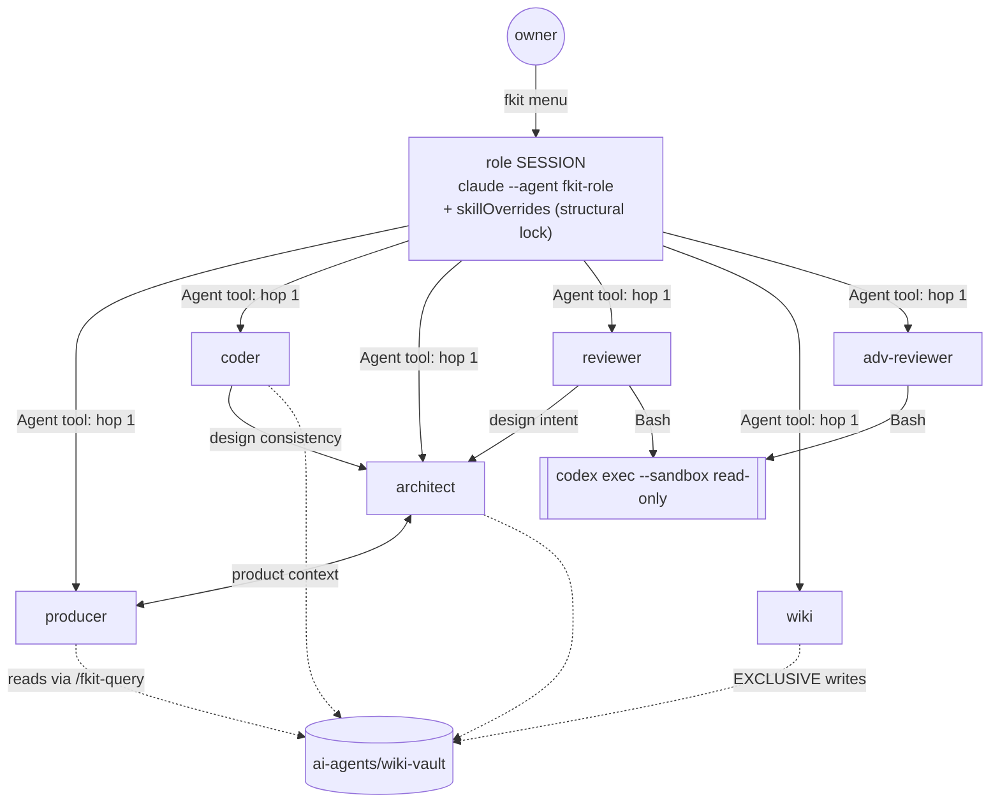

# fkit — Architecture

> **Initiation survey (re-run), 2026-07-11 — fkit-architect, `survey-project`.** A first-pass,
> evidence-first read of the code as it stands **in the working tree** (which is dirty; see
> §Working-tree divergence). It **replaces** the previous Omnigent-centric architecture doc, which
> described a runtime that ADR-009 has condemned.
>
> **Read this caveat first.** The project is **mid-Sprint 2** ("Remove Omnigent, land Claude-native as
> the only runtime", [`sprints/sprint-2.md`](../sprints/sprint-2.md)). `omnigent/` is **still present
> and still load-bearing at the installer level**, but it is **not settled architecture** — it is
> scheduled for deletion (Sprint 2 task 5, gated behind task 4). Everything about it is marked
> **CONDEMNED** below. Do not build on it, do not fix its drift, do not cite it as design.
>
> Every claim carries a `path:line` reference. Anything the code could not answer is an open question,
> not a guess. Deepen later via `/fkit-inspect`.

---

## 1. Overview and purpose

fkit is **not an application.** It is a **distributable team of role-scoped AI agents for software
development** — producer, coder, reviewer, adversarial reviewer, architect, wiki librarian, plus a
"team room" lead — that a developer installs once and runs inside *their own* project. This
repository **is the framework**: its "source" is agent definitions (markdown + YAML frontmatter),
skill playbooks (markdown procedures), POSIX shell installers/launchers, one small Node release
script, and documentation. There is no build, no server, no database, no test suite.

The product thesis (`ai-agents/knowledge-base/PROJECT.md:18-24`): AI coding assistants collapse
product decisions, implementation, and review into one undifferentiated chat loop with no separation
of authority. fkit's answer is a small **team** with distinct authority, coordinating over **files in
git** rather than shared runtime state.

**Stage:** prototype, dogfooded — this repo runs its own agents on its own `ai-agents/` tree
(`CLAUDE.md:16-24`).

---

## 2. System context and external dependencies

| Dependency | How it's used | Where |
|---|---|---|
| **Claude Code CLI (`claude`)** | The runtime. Every role session is `claude --agent fkit-<role> --settings <role>.json`. **Hard requirement** — the launcher exits 127 without it. | `claude/fkit-claude.sh:258-263,358` |
| **Codex CLI (`codex`)** | The adversarial second opinion, for genuine model diversity. `codex exec --sandbox read-only --cd "$PWD" -`. **Required prerequisite, warned-not-walled** (owner ruling, Sprint 2 task 3). | `claude/fkit-claude.sh:275-286`; `claude/skills/fkit-review/SKILL.md:57`; `claude/skills/fkit-adversarial-review/SKILL.md:42` |
| **git** | The substrate every agent reads; agents are barred from committing/pushing unprompted (prompt rule, not sandboxed). | `CLAUDE.md:26-30` |
| **GitHub, over the network** | (a) install: tarball from `codeload.github.com` (`install.sh:31`); (b) self-update **check**: throttled `git ls-remote` or the commits API (`claude/fkit-claude.sh:75-94`); (c) version banner: raw `VERSION` (`:88-94`). All time-boxed to 5s and silent on failure (`:65`). |
| **Node ≥ ESM** | Only to cut a release (`npm run release` → `bin/release.mjs`). Zero npm dependencies. | `package.json:3-9`, `bin/release.mjs:32-35` |
| ~~**Omnigent CLI**~~ | **CONDEMNED (ADR-009).** Still referenced by `install.sh` and `omnigent/`. | see §8 |

**fkit opens no ports, exposes no API, and stores no data outside the project's own files.**

---

## 3. Repository structure

```
fkit/
├── claude/                     ★ THE RUNTIME (ADR-009: the only one)
│   ├── agents/fkit-*.md          7 Claude Code subagent definitions (frontmatter + system prompt)
│   ├── skills/fkit-*/SKILL.md    21 /fkit-* skills — the role procedures
│   ├── scaffold/                 what a consuming project gets: ai-agents/ tree, CLAUDE.md, AGENTS.md
│   ├── fkit-claude.sh            the `fkit` command: self-update, preflight, role menu, launch
│   ├── fkit-claude-init.sh       idempotent per-project setup (scaffold + .claude/ refresh + intake)
│   └── README.md                 ⚠ STALE — describes the pre-ADR-010 "hat" model (see §9)
├── install.sh                  curl|sh entry point  ⚠ still dual-flavor (Sprint 2 task 4)
├── bin/release.mjs             bump VERSION+package.json → commit → tag v<x.y.z> → push
├── VERSION / package.json      version single-source-of-truth + release scripts (ADR-011)
├── ai-agents/                  fkit's OWN working structure (dogfooded)
├── README.md / CLAUDE.md / AGENTS.md   ⚠ README + AGENTS.md still describe two flavors (Sprint 2 task 8)
└── omnigent/                   ☠ CONDEMNED — Sprint 2 task 5 deletes it (see §8)
```

Local, gitignored, not part of the design surface: `.fkit/` (per-project state), `.claude/` (the
fkit-managed copies), `.omnigent/`, `.codex-tmp/` (`.gitignore:1-20`).

---

## 4. High-level architecture — the components

### 4.1 The seven roles

Each role is **one file**: `claude/agents/fkit-<role>.md` — YAML frontmatter (`name`, `description`,
`tools`, `color`, `initialPrompt`) plus a system prompt in the body. There is no shared base; each
prompt restates its own boundaries.

| Agent | `tools` allowlist | Authority |
|---|---|---|
| `fkit-producer` | Read, Grep, Glob, Bash, Write, Edit, Agent, Skill | product/sprint planning, task briefs. **No source writes.** Never moves task files. |
| `fkit-coder` | + `EnterPlanMode`, `ExitPlanMode` | **Sole source-write authority.** Plan-gated. |
| `fkit-architect` | Read, Grep, Glob, Bash, Write, Edit, Agent, Skill | design specs, ADRs, surveys. **Never implements; never writes the wiki.** |
| `fkit-reviewer` | Read, Grep, Glob, Bash, Write, Edit, Agent, Skill | review-only; writes **only** `ai-agents/reviews/`. |
| `fkit-adversarial-reviewer` | Read, Grep, Glob, Bash, Skill | findings only. **Structurally write-free — a leaf.** |
| `fkit-wiki` | Read, Grep, Glob, Bash, Write, Edit, Skill | **exclusive write gateway** for `ai-agents/wiki-vault/` (ADR-005). A leaf. |
| `fkit-lead` | Read, Grep, Glob, Bash, Skill, `Agent(...)` | the **team room** (menu 7). Routes; **does no work** — no Write/Edit. |

Evidence: `claude/agents/fkit-coder.md:8` (the plan-mode tools), `claude/agents/fkit-lead.md:6`,
`claude/agents/fkit-adversarial-reviewer.md:7`.

> **The `skills:` frontmatter is gone** — dropped from all 7 agents per **ADR-012 §1**, because
> Claude Code treats it as a *preload hint*, not an allowlist. It enforced nothing, so keeping it
> (even generated) would have preserved a field that *looks* like the invariant and isn't. **Do not
> re-add it.**

### 4.2 The 21 skills — where the procedures live

Skills (`claude/skills/fkit-*/SKILL.md`) are the durable, role-owned **procedures**; the agent
prompts are the role's *character*. Every role-specific skill opens with a `⛔ Owner:` banner naming
the one role allowed to execute it — which **ADR-012 §2 makes load-bearing**, not decorative, on the
consult path.

| Owner | Skills |
|---|---|
| producer | `initiate-project`, `task-plan`, `task-done`, `task-cancelled`, `status` |
| coder | `plan-task`, `process-review`, `process-stateful-review` |
| architect | `survey-project`, `inspect`, `design-spec`, `evaluate-approach`, `record-decision` |
| reviewer | `review`, `stateful-review` |
| adversarial | `adversarial-review` |
| wiki | `wiki-ingest`, `wiki-lint`, `wiki-sync` |
| everyone | `team` (the roster/signpost), `query` (read-only wiki reads — ADR-005) |

**Ownership is declared in exactly one place: `skills_for_role()` at
`claude/fkit-claude.sh:200-211`.** That function is the single source of truth (ADR-012 §1).

---

## 5. Runtime topology

### 5.1 One process. One role. No orchestrator.

There is no fkit daemon, no root agent, no session broker. Claude Code owns session lifecycle.

```
install.sh  (curl | sh, once)
   └─► ~/.local/share/fkit/{claude,omnigent,.version}  +  ~/.local/bin/fkit  (thin launcher)

fkit                                   (run in any project dir)
   ├─ self-host re-exec into ./claude/fkit-claude.sh if this IS an fkit checkout   :37-44
   ├─ throttled update CHECK → prints "run fkit update" (never auto-execs)         :122-142
   ├─ fkit-claude-init.sh <proj>  (idempotent: scaffold, .claude/ refresh, intake) :250-254
   ├─ preflight: claude required (exit 127) · codex required-but-warned            :258-286
   ├─ fresh project? → skip the menu, seed the PRODUCER into /fkit-initiate-project:288-308
   ├─ deterministic role MENU (1-7, an if/else — no LLM in the routing path)       :312-346
   └─ exec claude --agent fkit-<role> --settings .fkit/settings/<role>.json        :358
```

### 5.2 The role lock — precisely what it does and does not enforce (ADR-010 as amended by ADR-012)

A session is locked **two ways**:

1. **`--agent fkit-<role>`** — the role's system prompt and **tool allowlist** (harness-enforced).
2. **`--settings`** carrying **`skillOverrides`** — `build_settings()`
   (`claude/fkit-claude.sh:227-239`) writes `{"skillOverrides":{"<not-owned>":"off",…}}` to
   `.fkit/settings/<role>.json`. Every `fkit-*` skill the role does not own is **hidden from the `/`
   menu and unrunnable by name**.

**The scope of that lock is the honest part, and ADR-012 §2 pins it down:**

```
skill availability in ANY context
  = all installed skills − the skillOverrides of the SESSION THAT LAUNCHED THE PROCESS
```

- **In a role SESSION the lock is structural.** `fkit coder` genuinely cannot run `/fkit-review`.
  **This is the property reviewer independence rests on, and it holds.**
- **In a spawned CONSULT it is advisory.** A subagent inherits the *caller's* overrides, not its own.
  Only the agent prompt and the `⛔ Owner:` banner stand between a confused subagent and someone
  else's procedure. Stated as a known, accepted limit — **do not re-raise it as a blanket defect;
  a finding must say which path it means** (ADR-012 §Residual risks).
- **`CONSULT_SKILLS` (`claude/fkit-claude.sh:222`) is the escape valve** for that inheritance:
  `fkit-survey-project` and `fkit-query` stay ON for every role, because `/fkit-initiate-project` has
  the **producer** spawn the architect to run the survey — with it off, initiation could not run its
  own survey. The accepted cost: any role session can invoke `/fkit-survey-project` by name. **The
  set is deliberately minimal; adding to it is a decision, not a convenience** (ADR-012 §3).

### 5.3 Consultation — the Agent tool, two hops, no cycles

Cross-role work is a **consult**, never a role switch (ADR-010 §4): `@fkit-<role> <question>` spawns
a fresh context that answers and returns. Rules, carried in every agent prompt (e.g.
`claude/agents/fkit-architect.md`, "Consult rules — hard"): an invocation from the lead is **hop 0**;
every consult message must state *"you are being consulted at hop N of 2"*; at hop 2 you may not
consult anyone; never consult your invoker or anyone already in the chain; the asker keeps the
decision that is theirs; **genuinely new architecture decisions escalate to the owner.**

**This topology is prompt-enforced, and knowingly so** — Claude Code ignores `Agent(type)` allowlists
inside subagent definitions (ADR-010 §Consequences).



---

## 6. Data model — everything is a file in git

There is no database. The **`ai-agents/` tree is the entire coordination state** and the contract
every role shares (`ai-agents/README.md`):

| Path | Written by | Contents |
|---|---|---|
| `ai-agents/knowledge-base/PROJECT.md` | producer (`initiate-project`) | the prose product brief |
| `ai-agents/knowledge-base/architecture.md` | **architect** (`survey-project` / `inspect`) | this file |
| `ai-agents/knowledge-base/decisions/adr-NNN-*.md` | **architect** (`record-decision`) | ADRs; the **"Re-raise only if"** field is what stops re-litigation |
| `ai-agents/sprints/sprint-N.md` | producer | sprint plan + status table |
| `ai-agents/tasks/{backlog,done,cancelled}/*.md` | producer writes; **only the owner moves**, via `/fkit-task-done` / `/fkit-task-cancelled` | task briefs |
| `ai-agents/reviews/<task-id>.md` | reviewer **and** coder (two-party ledger) | findings + dispositions + **accepted residuals** — the loop-prevention memory |
| `ai-agents/wiki-vault/` | **fkit-wiki only** | Karpathy LLM-wiki: `schema.md`, `index.md`, `log.md`, `wiki/{features,systems,decisions,tasks}/`, `.wiki-watermark` (last-synced sha) |

**Status vocabulary is closed** (`ai-agents/knowledge-base/task-status-vocabulary.md:11-21`): Backlog
· In progress · Blocked · Done · Cancelled · Moved. Nothing else is valid; `Done`/`Cancelled` are
owner-only.

Per-project **generated** state (gitignored): `.fkit/settings/<role>.json` (the skill lockdown),
`.fkit/intake.md` (terminal intake answers), `.fkit/tmp/adversarial-prompt.md` (the codex prompt),
`.claude/agents/fkit-*.md` + `.claude/skills/fkit-*/` (fkit-managed copies — **edit `claude/`, never
these**; `claude/fkit-claude-init.sh:125-139`).

Global state: `~/.local/share/fkit/.version` (`version`/`sha`/`repo`/`ref`), `.update-check`
(throttle stamp), `.latest` (`install.sh:62-79`, `claude/fkit-claude.sh:67-73`).

---

## 7. Key flows

**1 — Install.** `curl … install.sh | sh` → fetch tarball → copy resources to
`~/.local/share/fkit/` → write `.version` → generate `~/.local/bin/fkit` (`install.sh:29-106`).

**2 — Fresh-project onboarding.** `fkit` → init scaffolds `ai-agents/` + `CLAUDE.md` + `AGENTS.md`
(never clobbering, `claude/fkit-claude-init.sh:27-47`) → `.fkit/interview` asks 6 questions **on the
terminal, before any LLM starts**, writing `.fkit/intake.md` (tty-safe; skips cleanly when headless,
`:66-123`) → the launcher detects the uninitialized `PROJECT.md` (`claude/fkit-claude.sh:289-295`)
and **skips the menu**, seeding the producer straight into `/fkit-initiate-project` (`:296-307`) →
the producer interviews, spawns the architect to run `fkit-survey-project`, and writes `PROJECT.md`.

**3 — Task flow.** producer `/fkit-task-plan` (decompose to the **smallest independently shippable**
units, dependency links recorded) → coder `/fkit-plan-task` (**Claude Code plan mode**, owner
approval gate) → implement → reviewer `/fkit-review` or `/fkit-stateful-review` → coder
`/fkit-process-stateful-review` → **owner** runs `/fkit-task-done`.

**4 — Review + adversarial pass.** The reviewer runs its own pass, then assembles a findings-only
prompt + inline diff into `.fkit/tmp/adversarial-prompt.md` and runs
`codex exec --sandbox read-only --cd "$PWD" -` (`claude/skills/fkit-review/SKILL.md:38-57`).
**Degradation is loud and mandatory**: no codex → the verdict is forced to a partial/`NOT
model-diverse` marker, as the *first thing a reader sees* (owner ruling, `sprints/sprint-2.md:124-129`).
A same-model "second opinion" is the failure this guards against.

**5 — Wiki.** **Reads are decentralized** (ADR-005): any context follows the read-only `/fkit-query`
procedure. **Writes are exclusive to `fkit-wiki`** (ingest / lint / sync). No exceptions, anywhere.

**6 — Self-update (ADR-009 §3).** A throttled (default 60 min), 5-second-capped, silent-on-failure
check that **only ever prints** `↑ fkit vX → vY is available. Run: fkit update`
(`claude/fkit-claude.sh:121-142`). It **never auto-execs** — deliberately unlike the Omnigent
launcher it replaces. Source checkouts are excluded (`_fkit_is_source_checkout`, `:73`).

**7 — Release (ADR-011).** `npm run release` → `bin/release.mjs`: bump `VERSION` + `package.json`
(patch by default), `git add -A`, commit, push, annotated tag `v<version>`, push tag. **No npm
publish** (`bin/release.mjs:66`). **Version bumping is load-bearing** — self-update resolves versions
against these tags.

---

## 8. ☠ CONDEMNED: `omnigent/` — present, referenced, and scheduled for deletion

**Do not treat any of this as architecture.** [ADR-009](decisions/adr-009-claude-code-native-is-the-only-runtime.md)
made Claude-native the **only** runtime; Sprint 2 task 5 (`tasks/backlog/delete-omnigent-directory.md`)
does the `git rm`, gated behind task 4 (the installer rewrite). It survives at survey time only
because deleting it before the installer is rewritten breaks installation itself.

What is still there: 7 Omnigent bundles (`omnigent/fkit-*/config.yaml` + `skills/`), `fkit.sh`,
`fkit-init.sh`, `fkit-reconnect.sh`, `fkit-team-restart.sh`, `vendor-agents.sh`,
`validate-bundles.sh`, `sync-vendored-skills.sh`, `README.md`.

**What still hard-references it, and is therefore genuinely load-bearing today:**

- `install.sh:32-35` — **exits 1** if `omnigent/fkit.sh` is missing.
- `install.sh:38-44` — copies `omnigent/` into every install.
- `install.sh:90-97` — the generated launcher routes `omnigent`, **and `update|upgrade|reconnect|restart-team`**, to `omnigent/fkit.sh`.

**Finding — the Omnigent flavor is already broken, and `fkit update` is mis-routed:**

1. **`fkit omnigent` cannot scaffold a fresh project.** `omnigent/fkit-init.sh:24` copies
   `$here/scaffold/ai-agents`, but Sprint 2 task 1 moved the scaffold to `claude/scaffold/` —
   `omnigent/scaffold/` **no longer exists**. The condemned flavor is already a dead man walking; this
   *lowers* the risk of deleting it, and is worth knowing before anyone tries to "keep it working".
2. **The new Claude self-update's `update` verb is unreachable from an installed fkit.** The generated
   launcher matches `update` **before** it ever reaches `claude/fkit-claude.sh` (`install.sh:90-97`),
   so `fkit update` still runs the Omnigent script's updater. It happens to work (it re-runs
   `install.sh`), but the code path built in Sprint 2 task 2 (`claude/fkit-claude.sh:104-119`) is
   currently **dead in the installed product**. Task 4 is what makes it live. *(Not a new defect —
   this is exactly the gap task 4 exists to close.)*
3. `claude/fkit-claude.sh:11` still advertises `fkit omnigent [...]` in its own help header, though the
   script no longer implements that case.

The ADRs that describe Omnigent mechanics — **ADR-003, 004, 005 (mechanism only), 006, 007** — are
"retired when the code is actually removed, not before" (`adr-009:123-127`). **ADR-005's *rule* —
reads decentralized, writes exclusive to fkit-wiki — survives the removal and is in force.**

---

## 9. Risks, technical debt, and drift

1. **`install.sh` is the blast radius of the entire sprint.** It is the `curl | sh` entry point; a bad
   landing breaks installation *including the self-update path that would ship the fix*
   (`tasks/backlog/rewrite-installer-single-flavor.md`). **Reading the diff is not verification** —
   it must be installed from a branch ref into a clean `$HOME`.
2. **Single-vendor concentration risk — accepted, not a defect.** fkit now runs only on Claude Code +
   Codex, with no fallback runtime. ADR-009 §Consequences takes this knowingly. **A finding of the
   form "fkit only runs on one vendor's CLI" is this decision, not a bug.**
3. **The consult path's skill boundary is advisory** (ADR-012 §2). The only real fix is a `PreToolUse`
   gate on the `Skill` tool — **deferred, and now priced**: decisions ADR-012 §2/§3 exist *because* we
   don't have it. **Open: does the hook payload even expose the calling subagent's identity?** If not,
   the hook isn't merely deferred, it's unavailable.
4. **Docs are pervasively stale against ADR-009/010/012** — all of it owned by Sprint 2 task 8
   (`rewrite-docs-post-omnigent.md`), so **don't fix it piecemeal**:
   - `README.md:1-46` — still sells two flavors and `fkit claude`.
   - `claude/README.md:19-33` — still describes the **deleted `/fkit-agent-<role>` "hat" model** and
     "the session is the lead *and* the coder", both superseded by ADR-010.
   - `ai-agents/knowledge-base/PROJECT.md:8-12,63-70,88-93` — still says dual-runtime; its
     `package.json` bullet still repeats ADR-001's "stop bumping `version`", **superseded by ADR-011**
     and actively wrong (bumping is load-bearing for self-update).
   - `AGENTS.md:5-11` — "an Omnigent-based team…"; `package.json:10,17-25` — `description`/`keywords`
     still say Omnigent (owned by task 5, per ADR-011).
   - `ai-agents/README.md:15-16` — "which model runs each agent is set in `omnigent/<agent>/config.yaml`".
   - `claude/fkit-claude-init.sh:144-153` — prints "**Six** roles" and omits `lead`, though it just
     copied **7** agents.
5. **No automated tests, no CI.** No `.github/workflows/`. Correctness of the shell entry points rests
   entirely on manual verification — which is why Sprint 2 task 7 is the release gate.
6. **`.claude/` copies are gitignored and refreshed by init.** A change made in `.claude/` instead of
   `claude/` is silently destroyed on the next launch (`claude/fkit-claude-init.sh:49-60`). The
   self-hosting re-exec (`claude/fkit-claude.sh:37-44`) exists precisely because the *installed*
   snapshot would otherwise overwrite the checkout's own working tree.
7. **`fkit --resume` / the blanket arg passthrough** (`claude/fkit-claude.sh:349`, `[ -n "$role" ] ||
   role="lead"`) silently resumes *any* session — coder included — under **lead's** lockdown. Omnigent
   scar tissue; removal is Sprint 2 task 18, sequenced after tasks 2 & 4.

---

## 10. Working-tree divergence from HEAD (2026-07-11)

This survey read the **working tree**, which is dirty. Uncommitted, and material to the above:

- **New: `decisions/adr-012-…md`** — the skill lockdown is session-scoped; `skills:` frontmatter
  dropped. Supersedes ADR-010 §§2 and 5 in part.
- **All 7 `claude/agents/*.md`** — the `skills:` frontmatter line removed (ADR-012 §1 landed).
- **`claude/fkit-claude.sh` (+127 lines)** — the Claude-path self-update (Sprint 2 task 2) and
  `CONSULT_SKILLS` (ADR-012 §3).
- **`claude/scaffold/CLAUDE.md`, `claude/skills/fkit-team/SKILL.md`** — the ADR-012 §2 doc-truth fix
  ("invisible and unrunnable" scoped to *sessions*).
- **`ai-agents/sprints/sprint-2.md`** + two task briefs moved `backlog/` → `done/`.

`claude/` and the fkit-managed `.claude/` copies are **in sync** (verified by `diff -rq`).

---

## 11. Open questions for the owner

Listed in §"Open questions" of the survey reply. Nothing here was guessed.
